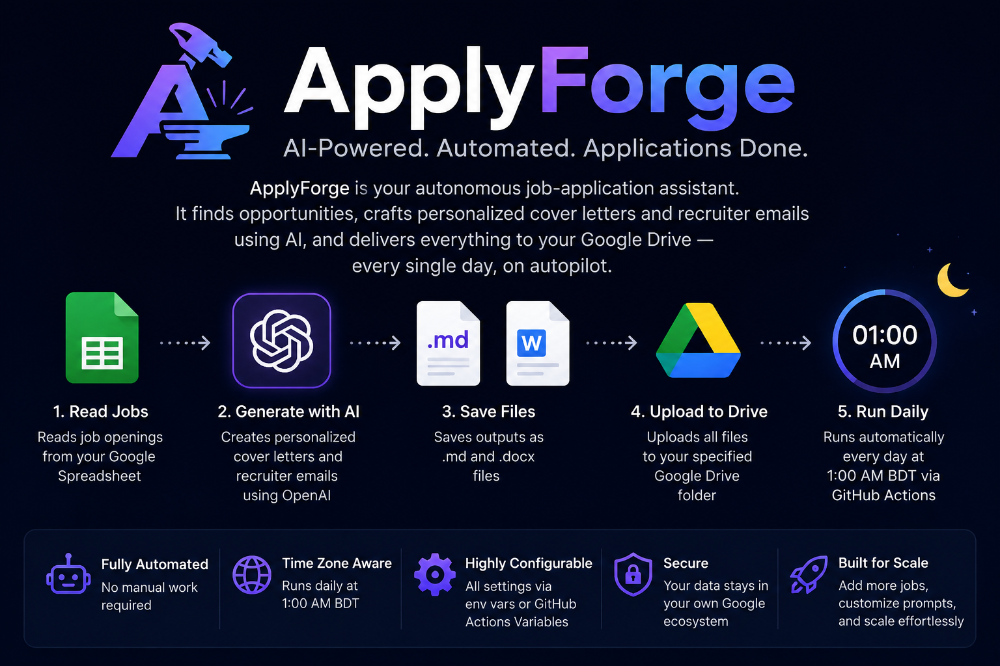

# ApplyForge

Automated daily job-application assistant.  Reads your job list from a Google
Spreadsheet, generates a personalized cover letter and recruiter email for each
opening using OpenAI, saves the files as `.md` and `.docx`, and uploads
everything to Google Drive — all without human intervention.

Runs every day at **1:00 AM Bangladesh Standard Time** via GitHub Actions.
Every configuration value is tunable through environment variables or GitHub
Actions Variables — no core code changes required.



---

## Table of Contents

1. [Architecture Overview](#architecture-overview)
2. [Documentation Website](#documentation-website)
3. [Project Structure](#project-structure)
4. [Prerequisites](#prerequisites)
5. [Google Cloud Setup](#google-cloud-setup)
6. [Google Drive Setup](#google-drive-setup)
7. [Spreadsheet Setup](#spreadsheet-setup)
8. [Resume Preprocessing Pipeline](#resume-preprocessing-pipeline)
9. [Local Development Setup](#local-development-setup)
10. [Testing](#testing)
11. [GitHub Actions Setup](#github-actions-setup)
12. [Configuration Reference](#configuration-reference)
13. [Cron Schedule Customization](#cron-schedule-customization)
14. [OpenAI Cost Optimization](#openai-cost-optimization)
15. [Generated Output Structure](#generated-output-structure)
16. [Troubleshooting](#troubleshooting)
17. [Changelog](CHANGELOG.md)

---

## Architecture Overview

```
Google Spreadsheet
    │
    ▼  (read rows where status = "not applied")
services/sheets.py
    │
    ├─► services/scraper.py          (fetch job description if missing)
    │
    ├─► services/resume_optimizer.py (load optimized .txt profile)
    │
    ├─► services/openai_client.py    (generate cover letter + email)
    │
    ├─► services/document_generator.py (.md + .docx output files)
    │
    └─► services/drive.py            (upload to Google Drive as your account)
    │
    ▼  (update row status → "draft generated")
Google Spreadsheet
```

The automation runs once per day.  Each job row is processed independently —
one failure does not stop the rest.

**Drive authentication** uses OAuth2 user credentials (your real Google account)
so that uploaded files are owned by you and charged to your Drive quota.
A service-account fallback is available for Shared Drive setups.

---

## Documentation Website

A static documentation site now lives in [`docs/`](docs/).  It packages the
main tutorials, workflow summary, configuration highlights, spreadsheet status
values, project layout, and command reference into a GitHub Pages-friendly
single page.

### Local preview

```bash
python -m http.server 8000 -d docs
```

Then open:

```
http://localhost:8000
```

### GitHub Pages deployment

The repository includes [`.github/workflows/docs-site.yml`](.github/workflows/docs-site.yml),
which deploys the `docs/` directory to GitHub Pages on pushes to `main`
whenever the docs or core documentation files change.

To enable it in GitHub:

1. Go to **Settings → Pages**.
2. Set **Source** to **GitHub Actions**.
3. Push to `main` or run the **Docs Site** workflow manually.

---

## Project Structure

```
applyforge/
│
├── .github/
│   └── workflows/
│       └── automation.yml          ← GitHub Actions daily workflow
│       └── docs-site.yml           ← GitHub Pages deployment workflow
│
├── docs/                           ← Static tutorial + reference website
│   ├── index.html
│   ├── styles.css
│   └── app.js
│
├── services/                       ← Modular service layer
│   ├── __init__.py
│   ├── config.py                   ← Centralized configuration (env vars)
│   ├── logger.py                   ← Structured logging factory
│   ├── sheets.py                   ← Google Sheets read/write
│   ├── drive.py                    ← Google Drive folder + upload
│   ├── openai_client.py            ← OpenAI chat-completion with retry
│   ├── scraper.py                  ← Job-page web scraper
│   ├── prompts.py                  ← All AI prompt templates
│   ├── document_generator.py       ← .md and .docx file generation
│   └── resume_optimizer.py         ← PDF extraction + profile loading
│
├── scripts/
│   ├── process_resume.py           ← One-time resume preprocessing script
│   └── generate_refresh_token.py   ← One-time OAuth2 token generation script
│
├── tests/                          ← Unit tests
│   ├── test_config.py              ← Config validation + singleton behavior
│   ├── test_document_generator.py  ← Output path + file generation tests
│   └── test_resume_optimizer.py    ← Resume loading + PDF text cleaning tests
│
├── raw_resumes/                    ← Drop your PDF resumes here (gitignored)
│   └── .gitkeep
│
├── resumes/                        ← Optimized .txt profiles (commit these)
│   ├── .gitkeep
│   ├── backend.txt
│   ├── ai.txt
│   └── default.txt
│
├── output/                         ← Generated documents (gitignored)
│   └── .gitkeep
│
├── logs/                           ← Daily log files (gitignored)
│   └── .gitkeep
│
├── main.py                         ← Entry point for the automation
├── requirements.txt
├── example.env                     ← Environment variable reference
├── .gitignore
└── README.md
```

---

## Prerequisites

| Tool | Version | Notes |
|------|---------|-------|
| Python | 3.11+ | Required |
| pip | latest | `pip install --upgrade pip` |
| Git | any | For cloning and GitHub Actions |
| Google Cloud account | free tier OK | For Sheets + Drive APIs |
| OpenAI account | paid | API key with billing enabled |

---

## Google Cloud Setup

### Step 1 — Create a Google Cloud Project

1. Go to [console.cloud.google.com](https://console.cloud.google.com).
2. Click **Select a project** → **New Project**.
3. Name it (e.g. `applyforge`) and click **Create**.

### Step 2 — Enable APIs

Enable both APIs in the project:

**Google Sheets API:**
```
APIs & Services → Library → search "Google Sheets API" → Enable
```

**Google Drive API:**
```
APIs & Services → Library → search "Google Drive API" → Enable
```

### Step 3 — Create a Service Account (for Sheets access)

1. Go to **IAM & Admin → Service Accounts → Create Service Account**.
2. Name it (e.g. `applyforge-sa`).
3. No roles needed at project level — access is granted per-spreadsheet.
4. Click **Done**.

### Step 4 — Create and Download a JSON Key

1. Click the service account you just created.
2. Go to the **Keys** tab → **Add Key → Create new key → JSON**.
3. The key file downloads automatically.
4. Open the file and copy its **entire contents** (the full JSON object).
5. This value goes into the `GOOGLE_SERVICE_ACCOUNT` secret.

> **Security:** Never commit this JSON file. Store it only as a GitHub Secret
> or in your local `.env` file (which is gitignored).

### Step 5 — Create an OAuth2 Client (for Drive uploads)

Drive uploads run as your real Google account to avoid service-account
storage quota errors. This requires a one-time OAuth2 setup.

1. Still in the same GCP project, go to **APIs & Services → Credentials**.
2. Click **+ Create Credentials → OAuth 2.0 Client ID**.
3. If prompted, configure the OAuth consent screen first:
   - User type: **External** → fill in app name (e.g. `ApplyForge`) → save.
4. Application type: **Desktop app** → name it → **Create**.
5. Click **Download JSON** → save as `oauth_client.json` in the project root.
   (`oauth_client.json` is gitignored — it will not be committed.)
6. Run the token generation script (see [Local Development Setup](#local-development-setup)).

### Step 6 — Share the Spreadsheet with the Service Account

1. Open your Google Spreadsheet.
2. Click **Share**.
3. Add the service account email (`name@project.iam.gserviceaccount.com`).
4. Give it **Editor** access → **Send**.

---

## Google Drive Setup

### Create a folder in your Google Drive

1. Go to [drive.google.com](https://drive.google.com).
2. Create a folder (e.g. `Applications`) in **My Drive**.
3. Open the folder and copy the **folder ID** from the URL:
   ```
   https://drive.google.com/drive/folders/<FOLDER_ID_HERE>
   ```
4. Set this as `GOOGLE_DRIVE_FOLDER_ID` in your `.env` and GitHub Variables.

> **Why OAuth2 instead of service account for Drive?**
> Service accounts have zero personal Drive storage quota. Uploading to a
> regular "My Drive" folder with a service account causes a
> `403 storageQuotaExceeded` error. OAuth2 user credentials fix this — files
> are uploaded as you, owned by you, and charged to your Drive quota.
> The service account is still used for Sheets access (it has no quota issues
> there).

---

## Spreadsheet Setup

Create a Google Spreadsheet with these exact column headers in row 1:

| status | company | role | job_id | link | description | resume_type |
|--------|---------|------|--------|------|-------------|-------------|

### Column descriptions

| Column | Required | Description |
|--------|----------|-------------|
| `status` | Yes | Workflow status (see values below) |
| `company` | Yes | Company name (used in file names and Drive folders) |
| `role` | Yes | Job title |
| `job_id` | No | Posting ID (used in output file names for uniqueness) |
| `link` | Yes* | Job posting URL — scraped if `description` is empty |
| `description` | No | Pre-filled job description (skips scraping) |
| `resume_type` | Yes | Key matching a profile in `resumes/` (e.g. `backend`, `ai`) |

### Status values

| Value | Meaning |
|-------|---------|
| `not applied` | Ready to process — picked up by the automation |
| `processing` | Currently being processed (set at start of each job) |
| `draft generated` | Email + cover letter generated and uploaded |
| `reviewed` | You reviewed and approved the draft |
| `applied` | Application submitted manually |
| `failed` | Processing failed — see logs for details |

### Example rows

| status | company | role | job_id | link | description | resume_type |
|--------|---------|------|--------|------|-------------|-------------|
| not applied | Stripe | Backend Engineer | JOB-001 | https://stripe.com/jobs/123 | | backend |
| not applied | OpenAI | ML Engineer | JOB-002 | https://openai.com/jobs/456 | | ai |
| not applied | Acme Corp | Full Stack Dev | JOB-003 | | We are looking for... | default |

---

## Resume Preprocessing Pipeline

The preprocessing pipeline converts your raw PDF resumes into compact,
token-efficient text profiles used at generation time.

### Why preprocess?

| Approach | Tokens per job | Cost per 100 jobs (approx) |
|----------|---------------|---------------------------|
| Raw PDF text (~1500 tokens) | ~2000 tokens total | ~$0.60 |
| Optimized profile (~400 tokens) | ~900 tokens total | ~$0.27 |

**Savings: ~55% per run.**

### Step 1 — Add your PDF resumes

Place your PDF resumes in the `raw_resumes/` directory.  Name each file to
match the `resume_type` value you use in the spreadsheet:

```
raw_resumes/
    backend.pdf    →  resumes/backend.txt   (resume_type: backend)
    ai.pdf         →  resumes/ai.txt        (resume_type: ai)
    default.pdf    →  resumes/default.txt   (resume_type: default)
```

### Step 2 — Run the preprocessing script

```bash
python scripts/process_resume.py
```

The script reads each PDF from `raw_resumes/`, extracts text via PyMuPDF,
calls OpenAI to generate a structured compressed profile, and saves it to
`resumes/<name>.txt`.

### Step 3 — Review the output

Open the generated `.txt` files and verify they contain all expected sections.
Edit manually if any section is missing or inaccurate.

### Step 4 — Commit the profiles

```bash
git add resumes/
git commit -m "Add optimized resume profiles"
git push
```

Profiles are committed to the repo (this is a **private** repo) so GitHub
Actions can access them at runtime without re-running preprocessing.

---

## Local Development Setup

### Step 1 — Clone the repository

```bash
git clone https://github.com/your-username/applyforge.git
cd applyforge
```

### Step 2 — Create a virtual environment

```bash
python -m venv .venv
source .venv/bin/activate      # macOS / Linux
# .venv\Scripts\activate       # Windows
```

### Step 3 — Install dependencies

```bash
pip install --upgrade pip
pip install -r requirements.txt
```

### Step 4 — Configure environment variables

```bash
cp example.env .env
```

Fill in `.env`:

```env
OPENAI_API_KEY=sk-...
GOOGLE_SERVICE_ACCOUNT={"type":"service_account","project_id":"..."}
GOOGLE_SHEET_NAME=Job Applications
GOOGLE_DRIVE_FOLDER_ID=1AbCdEfGhIjKlMnOpQrStUvWxYz   # from Drive folder URL
```

### Step 5 — Generate the OAuth2 refresh token (one-time)

Make sure `oauth_client.json` (downloaded in [Google Cloud Setup](#google-cloud-setup))
is in the project root, then run:

```bash
python scripts/generate_refresh_token.py
```

A browser window opens.  Log in with the Google account that owns the Drive
folder.  After authorizing, the script prints:

```
GOOGLE_OAUTH_CLIENT_ID=...
GOOGLE_OAUTH_CLIENT_SECRET=...
GOOGLE_OAUTH_REFRESH_TOKEN=...
```

Copy these into your `.env` file.  After copying, **delete `oauth_client.json`**.

### Step 6 — Preprocess resumes

```bash
# Place PDFs in raw_resumes/ first
python scripts/process_resume.py
```

### Step 7 — Run the automation locally

```bash
python main.py
```

### Step 8 — Run unit tests

```bash
python -m unittest discover -s tests -v
```

This project uses Python's built-in `unittest` runner. The current suite covers:

- `services/config.py` validation, directory creation, and singleton caching
- `services/document_generator.py` path building plus Markdown/DOCX output logic
- `services/resume_optimizer.py` text cleaning, missing-file handling, and fallback profile loading

---

## Testing

Unit tests live in `tests/` and use Python's standard `unittest` framework, so no extra test dependency is required.

### Run all tests

```bash
python -m unittest discover -s tests -v
```

### Current coverage

- `test_config.py`: required env validation, auto-created directories, `get_config()` singleton behavior
- `test_document_generator.py`: sanitized output paths, Markdown writes, DOCX generation behavior
- `test_resume_optimizer.py`: extracted text cleanup, missing PDF errors, resume profile fallback and empty-profile guards

### Notes

- Tests for DOCX and PDF code paths stub optional third-party imports where needed, so logic can be verified in lightweight environments.
- If you add new services or change workflow behavior, extend `tests/` in same PR to keep regressions visible.

---

## GitHub Actions Setup

### Step 1 — Push the repository to GitHub

```bash
git remote add origin https://github.com/FahimFBA/applyforge.git
git push -u origin main
```

### Step 2 — Add GitHub Secrets

Go to: **Repository → Settings → Secrets and variables → Actions → Secrets**

| Secret name | Value |
|-------------|-------|
| `OPENAI_API_KEY` | Your OpenAI API key (`sk-...`) |
| `GOOGLE_SERVICE_ACCOUNT` | Full content of the service-account JSON key (entire JSON object) |
| `GOOGLE_OAUTH_CLIENT_ID` | OAuth2 client ID (from `generate_refresh_token.py` output) |
| `GOOGLE_OAUTH_CLIENT_SECRET` | OAuth2 client secret (from `generate_refresh_token.py` output) |
| `GOOGLE_OAUTH_REFRESH_TOKEN` | OAuth2 refresh token (from `generate_refresh_token.py` output) |

> **Flatten the service-account JSON to one line before pasting:**
> ```bash
> cat service_account.json | python3 -m json.tool --compact
> ```

### Step 3 — Add GitHub Variables

Go to: **Repository → Settings → Secrets and variables → Actions → Variables**

| Variable | Default | Description |
|----------|---------|-------------|
| `GOOGLE_DRIVE_FOLDER_ID` | *(required)* | ID of your Drive folder (from folder URL) |
| `GOOGLE_SHEET_NAME` | `Job Applications` | Exact spreadsheet tab name |
| `GOOGLE_DRIVE_PARENT_FOLDER` | `Applications` | Fallback folder name (if ID not set) |
| `OPENAI_MODEL` | `gpt-4o-mini` | Model for generation |
| `OPENAI_TEMPERATURE` | `0.7` | Generation temperature |
| `MAX_JOBS_PER_RUN` | `10` | Per-run job cap |
| `RATE_LIMIT_DELAY` | `2` | Seconds between jobs |
| `REQUEST_TIMEOUT` | `20` | HTTP timeout (seconds) |
| `SCRAPE_TIMEOUT` | `30` | Scrape timeout (seconds) |
| `LOG_LEVEL` | `INFO` | Log verbosity |
| `OPENAI_RETRIES` | `3` | OpenAI retry count |
| `GOOGLE_RETRIES` | `3` | Google API retry count |
| `SCRAPE_RETRIES` | `2` | Scrape retry count |

### Step 4 — Commit your resume profiles

```bash
git add resumes/
git commit -m "Add optimized resume profiles"
git push
```

### Step 5 — Verify the workflow

Go to **Actions → ApplyForge Automation → Run workflow** to trigger a manual
run and confirm everything works before relying on the daily schedule.

---

## Configuration Reference

All configuration lives in `services/config.py` and is driven by environment
variables.

| Environment variable | Type | Default | Description |
|----------------------|------|---------|-------------|
| `OPENAI_API_KEY` | str | *(required)* | OpenAI API key |
| `GOOGLE_SERVICE_ACCOUNT` | str | *(required)* | Service-account JSON string (for Sheets) |
| `GOOGLE_OAUTH_CLIENT_ID` | str | *(required for Drive)* | OAuth2 client ID |
| `GOOGLE_OAUTH_CLIENT_SECRET` | str | *(required for Drive)* | OAuth2 client secret |
| `GOOGLE_OAUTH_REFRESH_TOKEN` | str | *(required for Drive)* | OAuth2 refresh token |
| `GOOGLE_SHEET_NAME` | str | `Job Applications` | Spreadsheet name |
| `GOOGLE_DRIVE_FOLDER_ID` | str | *(recommended)* | Drive folder ID from URL |
| `GOOGLE_DRIVE_PARENT_FOLDER` | str | `Applications` | Fallback folder name |
| `OPENAI_MODEL` | str | `gpt-4o-mini` | Generation model |
| `OPENAI_TEMPERATURE` | float | `0.7` | Generation temperature |
| `APP_TIMEZONE` | str | `Asia/Dhaka` | Timezone (informational) |
| `CRON_SCHEDULE` | str | `0 19 * * *` | Cron (informational; edit YAML to change) |
| `MAX_JOBS_PER_RUN` | int | `10` | Max rows processed per run |
| `RATE_LIMIT_DELAY` | float | `2` | Seconds sleep between jobs |
| `REQUEST_TIMEOUT` | int | `20` | HTTP request timeout (s) |
| `SCRAPE_TIMEOUT` | int | `30` | Scrape timeout (s) |
| `OPENAI_RETRIES` | int | `3` | OpenAI retry attempts |
| `GOOGLE_RETRIES` | int | `3` | Google API retry attempts |
| `SCRAPE_RETRIES` | int | `2` | Scrape retry attempts |
| `LOG_LEVEL` | str | `INFO` | Logging level |
| `OUTPUT_DIR` | str | `output` | Local output directory |
| `LOGS_DIR` | str | `logs` | Local logs directory |
| `RESUMES_DIR` | str | `resumes` | Optimized profiles directory |
| `RAW_RESUMES_DIR` | str | `raw_resumes` | Source PDF directory |

---

## Cron Schedule Customization

The schedule is defined in `.github/workflows/automation.yml`:

```yaml
on:
  schedule:
    - cron: "0 19 * * *"
```

GitHub Actions cron runs in **UTC**.  The table below shows common Bangladesh-
time targets and their UTC equivalents:

| Bangladesh Time (BST, UTC+6) | UTC cron expression |
|------------------------------|---------------------|
| 12:00 AM midnight | `0 18 * * *` |
| 1:00 AM | `0 19 * * *` ← default |
| 6:00 AM | `0 0 * * *` |
| 12:00 PM noon | `0 6 * * *` |
| 6:00 PM | `0 12 * * *` |
| 10:00 PM | `0 16 * * *` |

**Formula:** `BST hour - 6 = UTC hour` (if result is negative, add 24 and subtract 1 from the day).

To run only on weekdays:
```yaml
- cron: "0 19 * * 1-5"   # Monday–Friday at 1 AM BST
```

---

## OpenAI Cost Optimization

### Two-phase resume approach

Raw PDFs are processed **once** via `scripts/process_resume.py`.  The automation
uses only the compact `.txt` profiles — never the original PDFs.

| Stage | When | Token cost |
|-------|------|-----------|
| Resume preprocessing | Once per PDF update | ~1 200 tokens per resume |
| Per job (cover letter) | Each run | ~900 tokens |
| Per job (recruiter email) | Each run | ~550 tokens |
| **Total per job** | | **~1 450 tokens ≈ $0.0002** |

At `gpt-4o-mini` pricing, processing 10 jobs costs roughly **$0.002** per run.

### Additional cost controls

- `MAX_JOBS_PER_RUN` caps the number of API calls per workflow run.
- `max_tokens` is set conservatively per call (600 for cover letters, 400 for emails).
- Job descriptions are truncated to 4 000 chars before being sent to the API.
- `OPENAI_MODEL=gpt-4o-mini` is the default — upgrade to `gpt-4o` only if quality
  is insufficient.

---

## Generated Output Structure

```
output/
└── Stripe/
    ├── Stripe_JOB-001_recruiter_email.md
    ├── Stripe_JOB-001_cover_letter.md
    └── Stripe_JOB-001_cover_letter.docx

Google Drive (your-folder/):
└── Stripe/
    ├── Stripe_JOB-001_recruiter_email.md
    ├── Stripe_JOB-001_cover_letter.md
    └── Stripe_JOB-001_cover_letter.docx
```

---

## Troubleshooting

### `403 storageQuotaExceeded` on Drive upload

Service accounts have no personal Drive storage quota and cannot upload to
regular "My Drive" folders.  Fix: complete the OAuth2 setup in
[Google Cloud Setup — Step 5](#step-5--create-an-oauth2-client-for-drive-uploads)
and set the three `GOOGLE_OAUTH_*` secrets.

### `GOOGLE_SERVICE_ACCOUNT is required`

The secret is missing or empty.  Check:
- Local: `.env` file has the full JSON value (not just the file path).
- GitHub Actions: `GOOGLE_SERVICE_ACCOUNT` secret is set under
  **Settings → Secrets and variables → Actions → Secrets**.

### `SpreadsheetNotFound` error

- The spreadsheet name in `GOOGLE_SHEET_NAME` must match **exactly** (case-sensitive).
- The service account email must have **Editor** access to the spreadsheet.

### `FileNotFoundError: No resume profile found for type 'backend'`

Run the preprocessing script first:
```bash
python scripts/process_resume.py
```
Verify that `resumes/backend.txt` exists and is non-empty, then commit it.

### OAuth2 token generation returns no refresh token

The app was already authorized previously — Google does not re-issue a refresh
token on repeat consent.  Revoke access and rerun:

1. Go to [myaccount.google.com/permissions](https://myaccount.google.com/permissions).
2. Find and revoke the app.
3. Rerun `python scripts/generate_refresh_token.py`.

### Scraping returns empty or fails

Some job boards (LinkedIn, Indeed, Greenhouse) block automated requests.
Solutions:
1. Pre-fill the `description` column in the spreadsheet for those postings.
2. Copy the job description text manually and paste it into the sheet.
3. The automation falls back to a minimal stub and still generates output.

### Row stuck at "processing"

A previous run crashed after marking the row but before completing it.
Manually set the `status` back to `not applied` in the spreadsheet to retry.

### GitHub Actions: `No module named 'services'`

Ensure `main.py` and the `services/` directory are at the repository root
(not nested in a subdirectory) and that `requirements.txt` is also at the root.

### OpenAI rate limit errors

- Reduce `MAX_JOBS_PER_RUN` to process fewer jobs per run.
- Increase `RATE_LIMIT_DELAY` (e.g. to `5`) to add more pause between jobs.
- Check your OpenAI account tier — free-tier accounts have strict rate limits.

### Checking workflow logs

In GitHub Actions:
```
Actions → ApplyForge Automation → [run] → run-automation → Run ApplyForge automation
```

Locally, check `logs/automation_YYYYMMDD.log`.

---

## Changelog

See [CHANGELOG.md](CHANGELOG.md) for the full version history.
